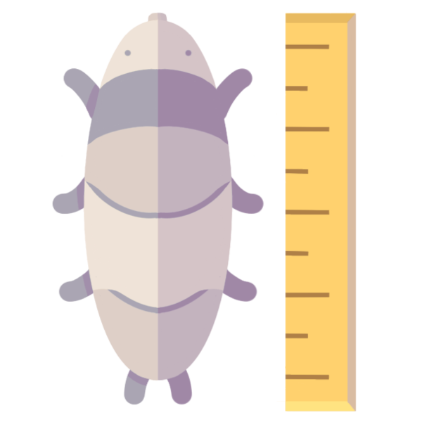
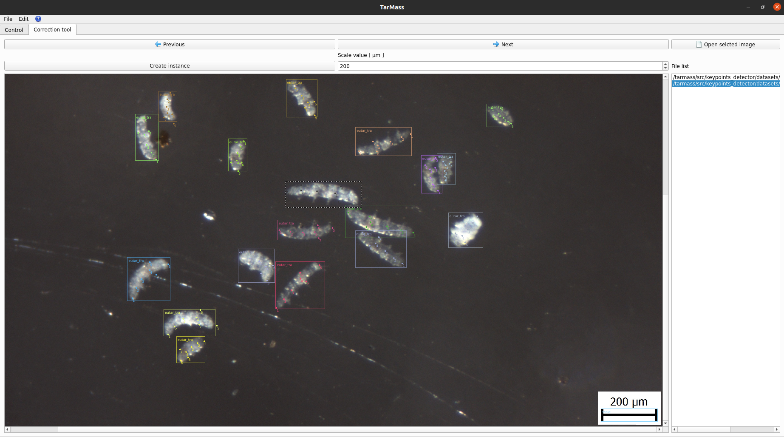

 *TarMass*
============
## Fast and accurate tool for tardigrade biomass estimation


The TarMass desktop application enables automatic detection, classification,
measurement and biomass estimation of tardigrade species in microscopic images.
The integrated tools allow the user to manually correct the detections and generate PDF report with statistics.

<p align="center">

</p>

Biomass estimation is done automatically, using few different algorithms:
* specie classification, detection and keypoints estimation - `Yolov8-pose` [1], `Keypoint RCNN` [2]
* specie length spline fitting - `quadratic`, `cubic`, `slinear`
* scale detection - `cv2.findContours` [3] + `custom contour selector`

Tardigrade mass approximation equations used, were introduced by Hallas & Yeates [4], [5]:
* *Eutardigrada*

$$ W = L \pi ({L \over 2R}) \times 1.04 \times 10^{-6}\ [\micro g] $$

* *Heterotardigrada*

$$ W = {1 \over 12} L \pi ({L \over R})^2 \times 1.04 \times 10^{-6}\ [\micro g] $$

*Where L is the length in μm, while R is the length-to-width ratio.*

### Build and run container
To automatically build and run the docker container, run:
```bash
docker-compose build
./run_docker.sh
```

To run GUI application:
```bash
cd src/
./run_gui_app.py
````
### Generate executable
Executable generation is done by `cx_freeze` package in `setup.py` file:

```bash
python3 setup.py build
```


### References
[1] https://github.com/ultralytics/ultralytics

[2] He, K., Gkioxari, G., Dollár, P., & Girshick, R. (2017). Mask r-cnn. In Proceedings of the IEEE international conference on computer vision (pp. 2961-2969).

[3] Suzuki, S. (1985). Topological structural analysis of digitized binary images by border following. Computer vision, graphics, and image processing, 30(1), 32-46.

[4] Hallas, T. E., & Yeates, G. W. (1972). Tardigrada of the soil and litter of a Danish beech forest. Pedobiologia.

[5] Jennings, P. G. (1976). The Tardigrada of Signy Island, South Orkney Islands, with a note on the Rotifera.
British Antarctic Survey Bulletin, 44, 1-25.

