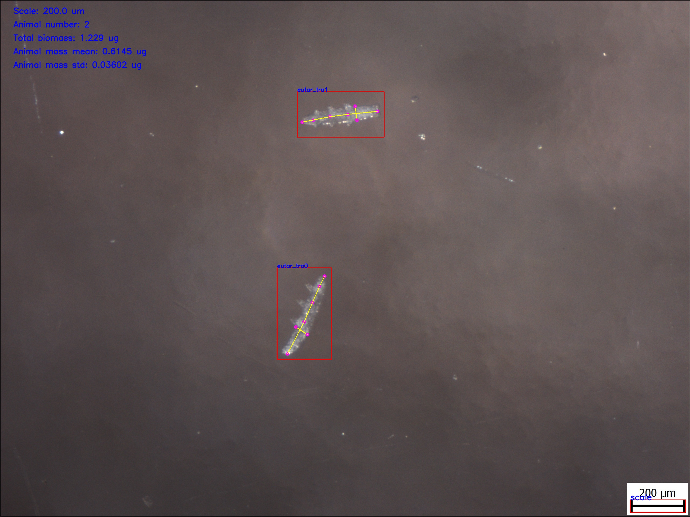

# Tardigrada
Automatic calculation of tardigrades biomass from microscopic images, using Deep Neural Networks.

### Build and run container
To automatically build and run docker container, launch script:
```bash
./build_and_run_docker.sh
```

To run GUI application:
```bash
cd src/
./run_gui_app.py
````

To run inference visualization:
```bash
./estimate_biomass.py -i $input_path -o $output_path
```


### Example Keypoint RCNN detection

<p align="center"> 

</p>

### References
[1] Hallas, T. E., & Yeates, G. W. (1972). Tardigrada of the soil and litter of a Danish beech forest. Pedobiologia.

[2] Jennings, P. G. (1976). The Tardigrada of Signy Island, South Orkney Islands, with a note on the Rotifera.
British Antarctic Survey Bulletin, 44, 1-25.

[3] Krizhevsky, A., Sutskever, I., & Hinton, G. E. (2012). 
Imagenet classification with deep convolutional neural networks.
Advances in neural information processing systems, 25, 1097-1105. 

[4] Zeiler, M. D., & Fergus, R. (2014, September). Visualizing and understanding convolutional networks. 
In European conference on computer vision (pp. 818-833). Springer, Cham.

[5] Toshev, A., & Szegedy, C. (2014). Deeppose: Human pose estimation via deep neural networks.
In Proceedings of the IEEE conference on computer vision and pattern recognition (pp. 1653-1660).